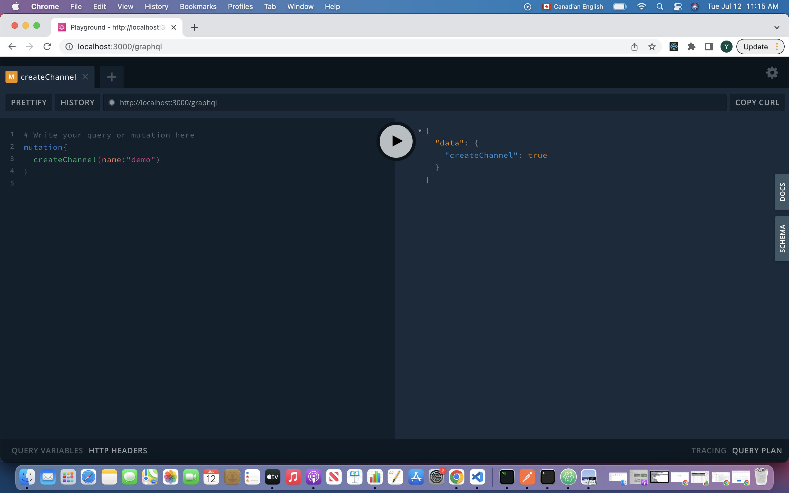
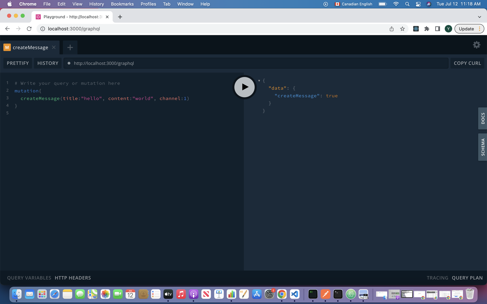
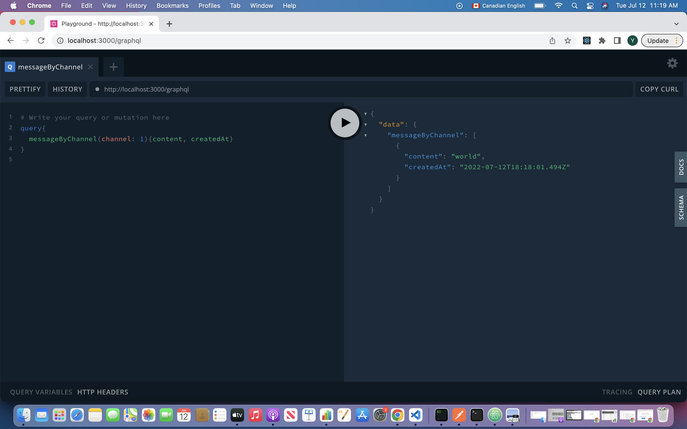

# GraphQL api demo

## Tech stacks

- Node.js/Express
- Typescript
- Type GraphQL
- Apollo
- Type ORM
- SQLite

## Getting started

Install dependencies:

```sh
yarn install
```

Running api Server:

```sh
yarn start
```

Running unit test:

```sh
yarn test
```

please head over to http://localhost:3000/graphql to execute your GraphQL query.

## Project directory

### src

- entity folder: defines models(DB schema, associations)

      Channel.ts: Channel model{id: number, name: string}
      Message.ts: Message model{id: number, title: string, content: string, createdAt: Date, channelId: number}

- resolvers folder: defines resolvers for CRUD

  - ChannelResolver.ts: mutaion and query for Channel

        createChannel(name: string | undefined), create a new channel record in Channel table, returns true if succesfuly created, false if not.

        channel(), fetch all channels

  - Sub MessageResolver.ts: mutation and query for Message

        createMessage(title: string | undefined, content: string, channelId: number), create a new message belongs to a channel, returns true if succesfuly created, false if not.

        message(), fetch all messages

        message(channelId: number), fetch all message belongs to a channel

- test-utils folder: connection to test DB, apollo server for test
- util folder: defines helper function
- \_\_tests\_\_ folder: jest unit/integration test for resolver
- index.ts: entry point to api server

## GraphQL demo

Create a new channel called demo1
</br>
Created a new message with title = "hello", content = "world"
</br>
Query content and date created for all messages belongs to channel id = 1
</br>
